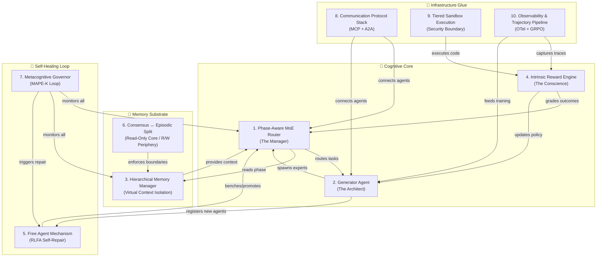
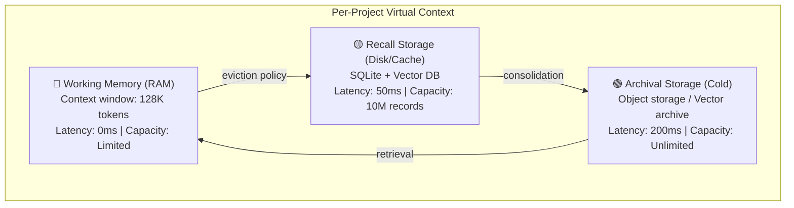
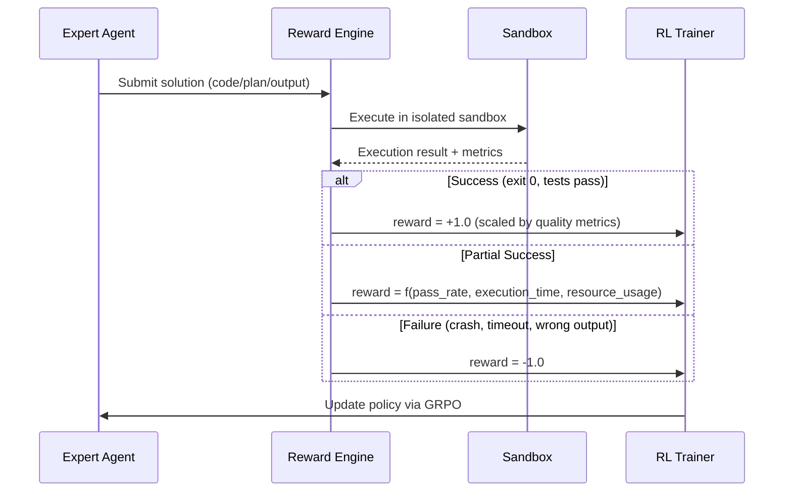
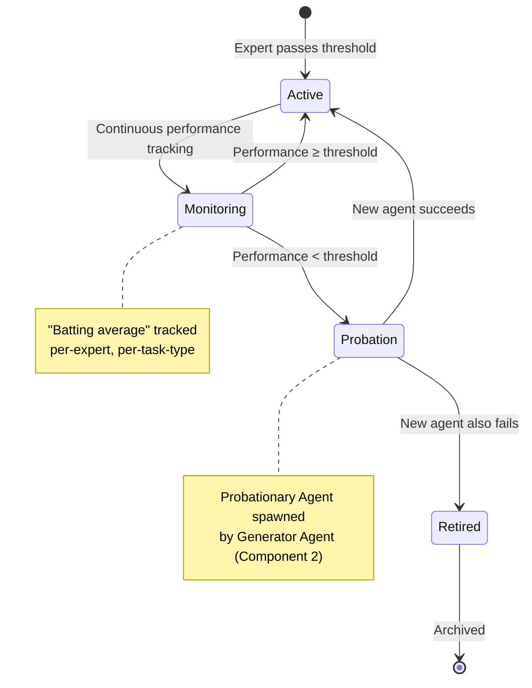
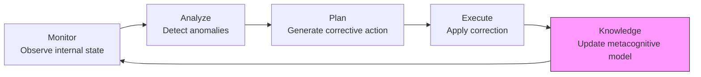
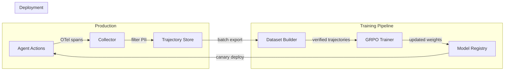
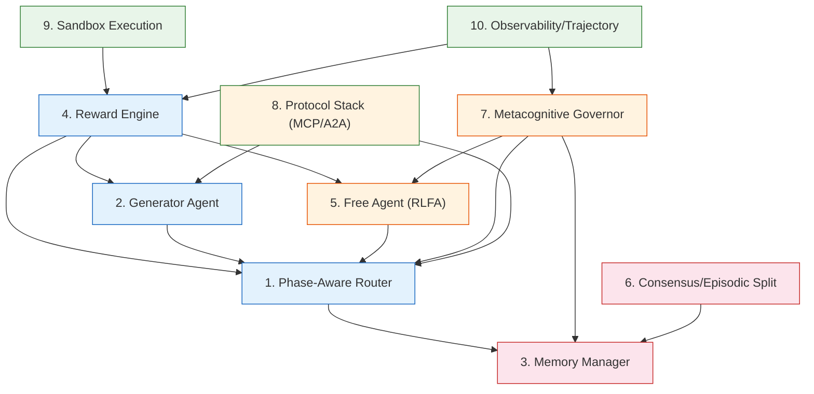
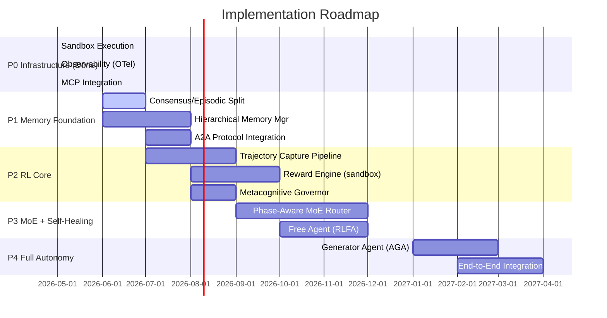

# MUST-HAVE Components of a 100% Autonomous Agent System

## MoE + RL + Dynamic Memory with Multi-Project Isolation/Parallelization

> **Research Scope:** 2024–2026 academic literature, production systems, and protocol standards.
> **Date:** 2026-05-20 | **Researcher:** Antigravity (Claude Opus 4.6 Thinking)
> **Project Context:** [AutonomousAgent](file:///Users/danielmanzela/RX-Research%20Project/AutonomousAgent)

---

## Executive Summary

A 100% autonomous agent system is not a monolithic model — it is a **recursive cognitive architecture** that actively constructs its own sub-agents, optimizes its own routing logic, and partitions its memory to prevent cross-contamination between projects. This document identifies **10 MUST-HAVE components** (the original 6 core + 4 critical "glue" subsystems) required to achieve true autonomy, sourced from 50+ papers and production systems from 2024–2026.

> [!IMPORTANT]
> The defining challenge for 2026 is no longer "model intelligence" but **agentic endurance** — the ability for a system to operate autonomously for hours/days/weeks without breaking, governed by metacognitive layers that ensure performance, safety, and reliability.

---

## Architecture Overview



---

## Component 1: Phase-Aware MoE Router (The "Manager")

### Why It's Non-Negotiable
Standard MoE routers fail at long-horizon tasks because they route **token-by-token**. For autonomous agents executing multi-step plans (e.g., "research → plan → code → test → deploy"), this causes catastrophic context switching — the system oscillates between experts mid-thought, destroying coherence.

### Technical Specification

| Property | Specification |
|---|---|
| **Routing Granularity** | Environment-step level, NOT token level |
| **Phase Discovery** | Learned end-to-end from RL objective (no pre-defined categories) |
| **Expert Architecture** | LoRA-based experts sharing a frozen base LLM |
| **Training Signal** | Penalized via RL if wrong expert activated for current phase |
| **Load Balancing** | Auxiliary-loss-free dynamic bias (DeepSeek-V3 style) |

### Key Innovations (2025–2026)

#### 1.1 Latent Phase Detection
From Yang et al. (2026) — *"Phase-Aware Mixture of Experts for Agentic RL"* [5]:
- The router learns **latent phase boundaries** directly from the RL objective
- Enforces **temporal consistency**: contiguous trajectory segments handled by same expert
- Addresses **simplicity bias**: prevents simple tasks from dominating gradient updates

#### 1.2 Auxiliary-Loss-Free Load Balancing
The field has moved **away from traditional auxiliary losses** which cause interference gradients:

| Approach | Mechanism | Status |
|---|---|---|
| **Traditional Auxiliary Loss** | Adds penalty term for uneven routing | ❌ Causes ~23% performance degradation via interference |
| **Dynamic Bias (DeepSeek-V3)** | Learnable bias term adjusts routing scores based on actual load | ✅ State-of-the-art |
| **Expert Choice Routing** | Experts select top-k tokens (inverted routing) | ✅ Intrinsic load balance |
| **Shared Expert** | Dedicated expert processes ALL tokens alongside routed experts | ✅ Common knowledge capture |

#### 1.3 Fine-Grained Expert Architecture
Modern MoE architectures trend toward **256+ smaller experts** rather than few large ones:
- More granular routing decisions
- Better computational efficiency via sparse activation
- Orthogonality loss ensures experts process distinct input types
- Variance loss increases routing score discriminability

### Implementation Pseudocode

```python
class PhaseAwareMoERouter:
    """Phase-level routing for agentic RL, not token-level."""

    def __init__(self, n_experts: int, base_model: LLM, phase_dim: int = 64):
        self.experts = [LoRAAdapter(base_model) for _ in range(n_experts)]
        self.shared_expert = LoRAAdapter(base_model)  # processes ALL inputs
        self.phase_encoder = PhaseEncoder(phase_dim)
        self.dynamic_bias = nn.Parameter(torch.zeros(n_experts))

    def route(self, observation, action_history, goal, load_stats):
        # Encode current phase from context (NOT individual tokens)
        phase_embedding = self.phase_encoder(observation, action_history, goal)

        # Compute routing scores with dynamic bias (aux-loss-free)
        raw_scores = self.gate_network(phase_embedding)
        adjusted_scores = raw_scores + self.dynamic_bias  # load-aware

        # Select top-k experts for this phase
        selected = top_k(adjusted_scores, k=2)

        # Update bias based on actual utilization (gradient-free)
        self.update_bias(selected, load_stats)

        # Combine shared expert output with routed expert outputs
        shared_out = self.shared_expert(observation)
        routed_out = weighted_sum([self.experts[i](observation) for i in selected])
        return shared_out + routed_out
```

### References
- [5] Yang et al., "Phase-Aware Mixture of Experts for Agentic Reinforcement Learning" (2026) — ResearchGate
- [6] arxiv.org/html/2602.17038v2
- [7] IBM — "Mixture of Experts" — ibm.com/think/topics/mixture-of-experts
- [8] arxiv.org/html/2512.02013v1
- ICLR 2026 — "Towards Stable and Effective RL for MoE"
- DeepSeek-V3 Technical Report — auxiliary-loss-free load balancing

---

## Component 2: RL-Driven Generator Agent (The "Architect")

### Why It's Non-Negotiable
Pre-defined experts eventually hit a ceiling. When the system encounters an **unseen problem class**, it cannot force an existing "square peg" expert into a "round hole" — it must be able to **design a new expert from scratch**.

### Technical Specification — Agent² Framework

From the Agent² paper (arxiv.org/html/2509.13368v2):

| Property | Specification |
|---|---|
| **Architecture** | Dual-agent: Generator Agent + Target Agent |
| **Pipeline** | Two-stage: MDP Modeling → Algorithmic Optimization |
| **Protocol** | Built on Model Context Protocol (MCP) |
| **Feedback Loop** | Closed-loop via TensorBoard metrics → LLM refinement |
| **Performance** | Up to 55% improvement over manually designed baselines |

### The Two-Stage Pipeline

#### Stage 1: Task-to-MDP Mapping
The Generator Agent converts natural language task descriptions into formal MDP:

```
Input: (T_task, T_env, T_c) → Problem Analysis → MDP(S, A, P, R, γ)
```

1. **Automatic Problem Analysis**: LLM processes task description + environment code
2. **MDP Modeling**: Optimizes observation space `s' = f_obs(s)`, action space `a' = f_act(a)`, and reward function `r_t = f_rew(s_t, a_t, s_{t+1})`
3. **Adaptive Verification**: Integrates components, runs verification operator, iterates on failures

#### Stage 2: Algorithmic Optimization
1. **Algorithm Selection**: Matches MDP characteristics to RL algorithm (DQN vs PPO vs SAC)
2. **Network Architecture Design**: LLM designs neural network topology
3. **Hyperparameter Optimization**: Sequential LLM-driven search
4. **Configuration Integration**: Unified YAML output with iterative refinement

### Instruction Following Reward Model
If the generated expert **fails** the task:
- Generator Agent receives **negative reward** (-1)
- Modifies the prompt/architecture of the expert
- Retries with corrective feedback: `P_error(L_analysis, f, e)` → `f*`

### Empirical Results (Agent²)
- **MuJoCo Ant (TD3)**: 3853.8 → 5981.4 (+55%)
- **MetaDrive SAC**: 178.2 → 259.8 (+46%)
- **SMAC 8m win rate**: 0.77 → 0.94 (+22%)
- Stage 1 improves performance in **83%** of scenarios
- Stage 2 delivers additional gains in **67%** of cases

### References
- [9][10][11] arxiv.org/html/2509.13368v2 — Agent²: An Agent-Generates-Agent Framework
- [12] v7labs.com — RLHF: Reinforcement Learning from Human Feedback
- [13] meegle.com — RLHF vs Traditional RL

---

## Component 3: Hierarchical Memory with Virtual Context Isolation

### Why It's Non-Negotiable
Multi-project isolation requires that Agent A (working on Project X) has **effective amnesia** regarding Project Y. Simple vector storage cannot achieve this — it requires a hierarchical architecture with namespace partitioning and policy-learned management.

### The Memory Taxonomy (from arxiv.org/html/2603.07670v1)

Memory is formalized as a **write–manage–read loop** within a POMDP-style agent cycle:

```
a_t = π_θ(R(M_t, x_t), g_t)    // action from policy + memory retrieval
M_{t+1} = U(M_t, x_t, a_t, o_t, r_t)  // memory update (NOT simple append)
```

> [!WARNING]
> `U` is NOT a simple append operation. In a well-designed system it summarizes, deduplicates, scores priority, resolves contradictions, and deletes. One bad write can pollute the store for many steps downstream.

### Four Memory Layers

| Layer | Human Analog | Agent Implementation | Access Pattern |
|---|---|---|---|
| **Working Memory** | Baddeley's central executive | LLM context window | Every inference call |
| **Episodic Memory** | Specific experiences | Tool call logs, observations, corrections | Retrieval-augmented |
| **Semantic Memory** | Abstract knowledge | Consolidated rules, heuristics | Reflection-triggered |
| **Procedural Memory** | Skills/habits | Executable code library (Voyager-style) | Direct invocation |

### Three-Dimensional Taxonomy

1. **Temporal Scope**: Working → Episodic → Semantic → Procedural
2. **Representational Substrate**: Context-resident text | Vector-indexed | Structured (SQL/KG) | Executable
3. **Control Policy**: Heuristic | Prompted self-control (MemGPT) | **Learned control (GRPO-trained)**

### Vertical Isolation: The Memory Hierarchy



### Horizontal Isolation: Namespace Partitioning (The "Multi-Project" Requirement)

```
┌─────────────────────────────────────────────────────┐
│                  CONSENSUS LAYER                     │
│    (Read-Only Core: Python syntax, API docs, etc.)   │
├────────────┬────────────┬────────────┬──────────────┤
│ Project A  │ Project B  │ Project C  │ Project D    │
│ namespace  │ namespace  │ namespace  │ namespace    │
│            │            │            │              │
│ Working    │ Working    │ Working    │ Working      │
│ Episodic   │ Episodic   │ Episodic   │ Episodic     │
│ Semantic   │ Semantic   │ Semantic   │ Semantic     │
│ Procedural │ Procedural │ Procedural │ Procedural   │
└────────────┴────────────┴────────────┴──────────────┘
```

**Context Swap Mechanism**: When switching from Project A to Project B:
1. Serialize Project A's entire working memory state
2. Flush context window
3. Load Project B's working memory state
4. Verify zero cross-contamination via namespace validation

### Learned Memory Management (Agentic Memory — Yu et al., 2026)

The most critical advancement: training memory operations as **RL policy actions** via three-stage GRPO:

| Operation | Description | When Triggered |
|---|---|---|
| `STORE` | Persist new observation/fact | New information arrives |
| `RETRIEVE` | Query memory for relevant context | Before each action |
| `UPDATE` | Modify existing memory entry | Contradiction detected |
| `SUMMARIZE` | Compress history into semantic record | Context budget pressure |
| `DISCARD` | Remove irrelevant/stale entries | Policy-learned (non-obvious) |

> [!TIP]
> Learned policies discover **non-obvious strategies** such as preemptive summarization BEFORE the context is full — something heuristic approaches never do.

### Critical Empirical Evidence

| System | Without Memory | With Memory | Delta |
|---|---|---|---|
| Generative Agents | Degenerate behavior in 48h | Months of coherent planning | Qualitative |
| Voyager (skill library) | Baseline speed | 15.3× faster milestone achievement | +1430% |
| MemoryArena (multi-session) | ~45% task completion | >80% task completion | +78% |

> The gap between "has memory" and "does not have memory" is often **larger** than the gap between different LLM backbones.

### Production Architecture Patterns (Mem0 vs Letta)

| Feature | Mem0 | Letta (formerly MemGPT) |
|---|---|---|
| **Type** | Pluggable memory layer | Full agent runtime |
| **Storage** | Hybrid: vector + graph + KV | Tiered: Core/RAM + Recall + Archival |
| **Memory Ops** | Auto extract/deduplicate/update | Self-editing tool calls |
| **Integration** | Bolt onto any framework | Agents run inside platform |
| **Best For** | Adding persistence to existing apps | Complex long-horizon autonomous agents |

### References
- [15][16] arxiv.org/html/2603.07670v1 — "Memory for Autonomous LLM Agents" (2026 survey)
- [17] arxiv.org/html/2508.19828v1
- [18] Databricks — Mosaic AI Agent Framework
- [19] Medium — Agentic Memory Types
- Packer et al. (2024) — MemGPT
- Yu et al. (2026) — Agentic Memory (GRPO-trained management)

---

## Component 4: Intrinsic Reward Modeling (The "Conscience")

### Why It's Non-Negotiable
A 100% autonomous system **cannot wait for human feedback**. It needs an internal engine that generates synthetic rewards to train all RL components — the MoE router, the Generator Agent, and the Memory Manager.

### The Reward Landscape (2025–2026)

| Paradigm | Mechanism | Limitation |
|---|---|---|
| **RLHF (2022–2024)** | Human-labeled preference pairs | Bottleneck: human labeling speed |
| **RLAIF (2024–2025)** | AI "teacher" grades "student" | Scalable but potential echo chamber |
| **RLVR (2025–2026)** | Verifiable rewards (code execution, math proofs) | Limited to verifiable domains |
| **RLIF (2025+)** | Self-certainty as reward (Intuitor) | Experimental |

### Implementation: The Sandbox Verification Loop



### Multi-Signal Reward Composition

The Reward Engine must unify **heterogeneous feedback signals** into a consistent scalar:

```python
class IntrinsicRewardEngine:
    """Unified reward computation from diverse verification signals."""

    def compute_reward(self, submission, sandbox_result) -> float:
        signals = {
            'correctness': self.verify_correctness(sandbox_result),     # -1 to +1
            'efficiency':  self.measure_efficiency(sandbox_result),      # 0 to +1
            'style':       self.assess_style(submission),                # 0 to +0.5
            'safety':      self.check_safety_violations(sandbox_result), # -2 to 0
        }

        # Weighted combination — safety violations dominate
        weights = {'correctness': 0.5, 'efficiency': 0.2, 'style': 0.1, 'safety': 0.2}
        reward = sum(signals[k] * weights[k] for k in signals)

        # Step-wise dense rewards (not just final outcome)
        if self.supports_step_rewards:
            step_rewards = self.compute_step_rewards(submission.trajectory)
            reward = self.blend_step_and_outcome(step_rewards, reward)

        return reward
```

### Advanced Techniques (2025–2026)

#### 4.1 RISE — Reinforcing Reasoning with Self-Verification
- Trains LLMs to simultaneously improve problem-solving AND self-verification in a single RL loop
- Uses outcome verifiers for on-the-fly feedback
- Models learn to critique their own trajectories

#### 4.2 ReVeal — Multi-Turn Generation-Verification
- Interleaves code generation with explicit self-verification
- Agent autonomously generates test cases
- "Co-evolution" of generation and verification capabilities

#### 4.3 ONI — Online Intrinsic Rewards
- Uses LLMs to annotate agent experiences **asynchronously**
- Distills annotations into an intrinsic reward model
- Dense reward signals in high-throughput settings

#### 4.4 Step-Wise GRPO (CUDA Agent)
The CUDA Agent (Feb 2026) pioneered step-wise verification for agentic RL:
- **Multi-stage warm-up**: single-turn RL → Rejection Fine-Tuning → Value Pretraining
- **Dense step-wise verification**: syntax checks, runtime exceptions, profiling bottlenecks
- **Result**: Outperforms `torch.compile` and Claude Opus 4.5 on KernelBench

### References
- [21] cuda-agent.github.io — CUDA Agent paper
- [22] arxiv.org/html/2505.23723v2
- [23] blaxel.ai — How AI Agents Execute Code
- [24] boringbot.substack.com — Karpathy's AutoResearch Explained
- RISE (ICLR 2026) — Reinforcing Reasoning with Self-Verification
- ReVeal (arxiv 2025) — Iterative Generation-Verification
- Intuitor (arxiv 2025) — RLIF with Self-Certainty

---

## Component 5: The Free Agent Mechanism (RLFA — Self-Repair)

### Why It's Non-Negotiable
Even with the best MoE routing, experts **inevitably degrade** over time due to data drift, distribution shift, or accumulated errors. Without self-repair, the system's performance decays monotonically.

### RLFA Algorithm (Liu, 2025 — arxiv.org/abs/2501.17903)

Inspired by MLB free agency, the RLFA algorithm introduces a **reward-based lifecycle** for experts:



### The Expert Lifecycle

| Phase | Trigger | Action | Duration |
|---|---|---|---|
| **Active** | Performance ≥ threshold | Normal operation | Indefinite |
| **Warning** | Performance dips 10% below rolling avg | Increased monitoring frequency | 100 steps |
| **Benched** | Performance < absolute threshold | Deactivated; Probationary Agent spawned | Until replacement validated |
| **Probation** | New agent testing | New agent must outperform on same task set | 200 steps |
| **Replaced** | Probationary agent succeeds | Old agent archived; new agent promoted | Permanent |
| **Reinstated** | Probationary agent fails | Old agent reactivated; alternative approach tried | Retry |

### Performance Metrics Tracked

```python
class ExpertPerformanceTracker:
    """Tracks 'batting average' for each expert."""

    def __init__(self, window_size=500, threshold=0.7):
        self.window_size = window_size
        self.threshold = threshold
        self.history = defaultdict(deque)  # expert_id → deque of (task, reward)

    def record(self, expert_id: str, task_type: str, reward: float):
        self.history[expert_id].append((task_type, reward, time.time()))
        if len(self.history[expert_id]) > self.window_size:
            self.history[expert_id].popleft()

    def batting_average(self, expert_id: str) -> float:
        """Rolling success rate over window."""
        if not self.history[expert_id]:
            return 1.0  # benefit of the doubt for new experts
        successes = sum(1 for _, r, _ in self.history[expert_id] if r > 0)
        return successes / len(self.history[expert_id])

    def should_bench(self, expert_id: str) -> bool:
        return self.batting_average(expert_id) < self.threshold

    def detect_drift(self, expert_id: str) -> bool:
        """Detect performance trend degradation (not just absolute threshold)."""
        recent = list(self.history[expert_id])[-100:]
        older = list(self.history[expert_id])[-200:-100]
        if len(recent) < 50 or len(older) < 50:
            return False
        recent_avg = sum(r for _, r, _ in recent) / len(recent)
        older_avg = sum(r for _, r, _ in older) / len(older)
        return (older_avg - recent_avg) / max(older_avg, 0.01) > 0.10  # 10% decline
```

### Connection to Other Components
- **Generator Agent (Component 2)** spawns the Probationary Agent
- **Reward Engine (Component 4)** provides the performance signal
- **MoE Router (Component 1)** updates routing tables when experts are swapped
- **Observability (Component 10)** logs all lifecycle transitions

### References
- [3][25][26][27] arxiv.org/abs/2501.17903 — RLFA paper (Liu, 2025)
- Lazarus (arxiv 2025) — Fault-tolerant MoE training infrastructure
- TAR² — Temporal-Agent Reward Redistribution

---

## Component 6: Consensus vs. Episodic Memory Split

### Why It's Non-Negotiable
For effective parallelization, the system must distinguish between **facts true for all projects** (consensus) and **facts true only for one project** (episodic). Without this, project-specific data overwrites universal knowledge, causing catastrophic hallucination leakage.

### The Read-Only Core / Read-Write Periphery Design

```
┌─────────────────────────────────────────────────┐
│           READ-ONLY CONSENSUS CORE               │
│                                                  │
│  • Python syntax rules                           │
│  • API documentation                             │
│  • Organizational policies                       │
│  • Universal safety constraints                  │
│  • Verified procedures (SOPs)                    │
│  • Core persona definitions                      │
│                                                  │
│  ⚠️  WRITE REQUIRES: Verification + Quorum       │
│  ⚠️  Individual agents CANNOT modify             │
└──────────────────────┬──────────────────────────┘
                       │ READ-ONLY access
        ┌──────────────┼──────────────┐
        ▼              ▼              ▼
┌──────────────┐ ┌──────────────┐ ┌──────────────┐
│ PROJECT A    │ │ PROJECT B    │ │ PROJECT C    │
│ R/W Periphery│ │ R/W Periphery│ │ R/W Periphery│
│              │ │              │ │              │
│ Scratchpads  │ │ Scratchpads  │ │ Scratchpads  │
│ Task logs    │ │ Task logs    │ │ Task logs    │
│ Collab notes │ │ Collab notes │ │ Collab notes │
│ Episodic mem │ │ Episodic mem │ │ Episodic mem │
└──────────────┘ └──────────────┘ └──────────────┘
```

### Promotion Protocol (Periphery → Core)

Information can only enter the Consensus Core through a **tiered escalation**:

1. **Agent writes** to project-specific periphery (immediate)
2. **Verification agent** validates against existing core knowledge
3. **Conflict resolution**: if contradicts existing core entry → flagged for review
4. **Quorum**: multiple independent agents must confirm the fact
5. **Promotion**: entry added to read-only core with audit trail

### Anti-Pollution Mechanisms

| Mechanism | Purpose | Implementation |
|---|---|---|
| **Namespace ACLs** | Prevent cross-project reads | Database-level row security |
| **Write-Ahead Log** | Auditability for all writes | Append-only log per project |
| **Contradiction Checker** | Detect conflicting memories | Embedding similarity + LLM judge |
| **Expiration Policy** | Remove stale episodic records | TTL + access-frequency decay |
| **Zero-Trust Handoff** | Audit every cross-agent transfer | Logged + schema-validated |

### References
- [28] ink.library.smu.edu.sg — Consensus memory architecture
- [29] arxiv.org/html/2402.03578v2
- MongoDB Engineering Blog — "Why Multi-Agent Systems Need Memory Engineering"

---

## Component 7: Metacognitive Governor (MAPE-K Loop) — **NEW**

> [!IMPORTANT]
> This component was NOT in the original 6 but is **MUST-HAVE** for 100% autonomy. Without metacognition, the system has no "audit layer" — it cannot detect when it is stuck, looping, or degrading.

### Why It's Non-Negotiable
Autonomous agents are **non-deterministic** and build their own execution paths at runtime. Without a metacognitive governor, failure modes include:
- **Infinite loops**: Agent repeatedly calls the same tool with similar parameters
- **Reasoning collapse**: Agent abandons complex reasoning for simpler (wrong) approach
- **Error cascade**: One bad decision propagates through the entire chain

### The MAPE-K Architecture



| Phase | Function | Signals Used |
|---|---|---|
| **Monitor** | Track agent step depth, tool call frequency, context usage | OpenTelemetry spans |
| **Analyze** | Detect loops, stalls, confidence drops, context exhaustion | Pattern matching + anomaly detection |
| **Plan** | Determine corrective action (retry, escalate, context refresh) | Rule-based + learned policy |
| **Execute** | Apply the correction (inject hint, swap expert, prune context) | Direct intervention |
| **Knowledge** | Update internal model of failure patterns | Reflective memory store |

### Step-Level Anomaly Detection

```python
class MetacognitiveGovernor:
    """Monitors agent behavior and triggers corrections before errors propagate."""

    MAX_STEPS_WITHOUT_PROGRESS = 10
    MAX_IDENTICAL_TOOL_CALLS = 3
    CONFIDENCE_FLOOR = 0.3

    def check_health(self, trajectory: List[Step]) -> HealthReport:
        issues = []

        # Loop detection
        recent_tools = [s.tool_call for s in trajectory[-5:]]
        if len(set(str(t) for t in recent_tools)) == 1 and len(recent_tools) >= 3:
            issues.append(Issue.INFINITE_LOOP)

        # Progress stall
        if not any(s.made_progress for s in trajectory[-self.MAX_STEPS_WITHOUT_PROGRESS:]):
            issues.append(Issue.STALLED)

        # Confidence collapse
        if trajectory[-1].confidence < self.CONFIDENCE_FLOOR:
            issues.append(Issue.LOW_CONFIDENCE)

        # Context exhaustion
        if trajectory[-1].context_usage > 0.9:
            issues.append(Issue.CONTEXT_EXHAUSTION)

        return HealthReport(issues=issues, recommended_actions=self.plan(issues))
```

### References
- zylos.ai — "Self-Regulatory Agent Architecture with MAPE-K"
- aclanthology.org — Metacognitive Agent Architectures (2025)
- Metagent-P — Self-reflective planning agents

---

## Component 8: Communication Protocol Stack (MCP + A2A) — **NEW**

> [!IMPORTANT]
> Without standardized communication, agents cannot discover each other, negotiate tasks, or delegate work. The protocol stack is the "nervous system" of the architecture.

### The 2026 Protocol Stack

| Layer | Protocol | Purpose | Governance |
|---|---|---|---|
| **Agent-to-Tool** | **MCP** (Model Context Protocol) | Connect agents to data, APIs, tools | Linux Foundation (Agentic AI Foundation) |
| **Agent-to-Agent** | **A2A** (Agent2Agent Protocol) | Peer-to-peer delegation, task coordination | Linux Foundation |
| **Messaging** | **ACP/ANP** | Specialized messaging, commerce, decentralized | Various |

### MCP — The Agent-to-Tool Standard
- **Status**: De facto infrastructure layer with 97M+ monthly SDK downloads
- **Adoption**: OpenAI, Anthropic, Google, Microsoft
- **2026 Roadmap**: OAuth 2.1/SAML auth, "MCP Server Cards" for metadata discovery
- **Your System**: Already uses MCP extensively (see [mcp-inventory.md](file:///Users/danielmanzela/RX-Research%20Project/AutonomousAgent/docs/mcp-inventory.md))

### A2A — The Agent Coordination Standard
- **Origin**: Google (April 2025), donated to Linux Foundation (June 2025)
- **Transport**: JSON-RPC 2.0 over HTTP
- **Key Features**:
  - **Agent Cards**: JSON metadata for discovery (capabilities, auth requirements)
  - **Task Lifecycle**: `pending → running → completed/failed`
  - **Streaming**: Server-sent events for long-running tasks
- **Backed by**: 150+ organizations

### Integration Pattern for Your Architecture

```
┌─────────────────────────────────────────────┐
│              ORCHESTRATOR                     │
│  (Phase-Aware Router — Component 1)          │
├──────────┬──────────┬──────────┬────────────┤
│ Expert A │ Expert B │ Expert C │ Generator  │
│          │          │          │ Agent      │
│   MCP ↕  │   MCP ↕  │   MCP ↕  │   MCP ↕   │
│  Tools   │  Tools   │  Tools   │  Tools     │
└────┬─────┴────┬─────┴────┬─────┴────┬───────┘
     │    A2A   │    A2A   │    A2A   │
     └──────────┴──────────┴──────────┘
```

### References
- Google Blog — A2A Protocol specification
- workos.com — MCP 2026 roadmap and SDK adoption
- Linux Foundation — Agentic AI Foundation charter

---

## Component 9: Tiered Sandbox Execution (Security Boundary) — **NEW**

> [!IMPORTANT]
> An autonomous agent that generates and executes arbitrary code without sandboxing is an **active security threat**. This component is the line between "autonomous agent" and "uncontrolled vulnerability."

### Why It's Non-Negotiable
AI agents generate and execute **arbitrary code**. Without tiered isolation:
- Prompt injection → code execution → host compromise
- Data exfiltration via unrestricted network egress
- Resource exhaustion (CPU/memory/disk)
- Cross-project contamination via shared filesystem

### The Isolation Hierarchy (2026 Best Practice)

| Tier | Technology | Isolation Level | Use Case | Startup |
|---|---|---|---|---|
| **Tier 0** | In-process | None | Safe operations (read file, format text) | 0ms |
| **Tier 1** | Docker container | Namespace isolation (shared kernel) | Trusted code execution | ~500ms |
| **Tier 2** | gVisor | User-space kernel (syscall interception) | Semi-trusted code | ~200ms |
| **Tier 3** | Firecracker microVM | Full hardware isolation (own kernel) | Untrusted code | <200ms |
| **Tier 4** | WASM sandbox | Capability-based (no OS access) | Stateless functions | <10ms |

### Defense-in-Depth Configuration

```yaml
# Security boundary configuration
sandbox:
  default_tier: 2  # gVisor for most operations

  network:
    egress_allowlist:
      - "api.anthropic.com"
      - "us-central1-aiplatform.googleapis.com"
      - "github.com"
    deny_all_other: true

  filesystem:
    read_only_mounts:
      - /usr/lib
      - /etc/ssl
    writable_mounts:
      - /workspace  # project-specific, ephemeral
    denied_paths:
      - /root
      - /etc/shadow

  resources:
    max_cpu_seconds: 300
    max_memory_mb: 4096
    max_disk_mb: 10240

  lifecycle:
    ephemeral: true  # destroy after each task
    max_lifetime_seconds: 3600
```

### Your System's Existing Implementation
Your AutonomousAgent already implements tiered sandboxing (see [README](file:///Users/danielmanzela/RX-Research%20Project/AutonomousAgent/README.md) L28-29):
- In-process tier for safe operations
- Docker `shell-sandbox` service for untrusted execution
- Network egress allowlist
- Output secret scrubbing

### References
- E2B — Firecracker microVM sandboxes for AI agents
- Northflank — Production-grade Kata Container isolation
- Modal — gVisor-based serverless compute
- Your project's [architecture spec](file:///Users/danielmanzela/RX-Research%20Project/AutonomousAgent/docs/superpowers/specs/2026-05-14-hermes-agent-architecture-design.md)

---

## Component 10: Observability & Trajectory Pipeline (OTel + GRPO) — **NEW**

> [!IMPORTANT]
> Without observability, you cannot train the RL components. Without trajectory capture, the system cannot self-improve. This component is the **data backbone** of the entire recursive architecture.

### Why It's Non-Negotiable
The system needs to:
1. **Monitor** all agent behavior in production (detect failures, loops, drift)
2. **Capture** execution traces as training data for GRPO/DPO
3. **Close the loop** from production → training → deployment

### The Four Observability Pillars

| Pillar | Metrics | Tools |
|---|---|---|
| **Operational** | Latency (TTFT), error rates, throughput, cost/request | OpenTelemetry, Prometheus |
| **Tool Performance** | Tool reliability, error frequency, latency per tool | Custom OTel spans |
| **Behavioral** | Step depth, context usage, loop detection, decision branching | Metacognitive Governor |
| **Quality (Evals)** | Faithfulness, goal achievement, response relevance | LLM-as-Judge, unit tests |

### OpenTelemetry Integration

```python
# GenAI Semantic Conventions (standardized 2025)
span.set_attribute("gen_ai.system", "anthropic")
span.set_attribute("gen_ai.request.model", "claude-4.7-opus")
span.set_attribute("gen_ai.usage.input_tokens", 12847)
span.set_attribute("gen_ai.usage.output_tokens", 3291)

# Custom agentic attributes
span.set_attribute("agent.expert_id", "coder-v3")
span.set_attribute("agent.phase", "execution")
span.set_attribute("agent.project_namespace", "project-alpha")
span.set_attribute("agent.memory.context_usage_pct", 0.73)
span.set_attribute("agent.tool.name", "code_executor")
span.set_attribute("agent.tool.sandbox_tier", 2)
```

### Trajectory Capture Pipeline for RL Training



### The Modern RL Training Stack (2026)

| Stage | Method | Best For |
|---|---|---|
| **Base** | SFT (Supervised Fine-Tuning) | Instruction following, formatting |
| **Alignment** | DPO/SimPO/KTO | Preference alignment (static data) |
| **Reasoning** | **GRPO** (Group Relative Policy Optimization) | Verifiable tasks (math, code, tools) |
| **Advanced** | DAPO (Decoupled Clip + Dynamic Sampling) | Long chain-of-thought, length bias fix |

#### GRPO Advantage Computation
```
A_i = (r_i - mean(r_group)) / std(r_group)
```
- No separate critic/value model needed
- Samples multiple responses per prompt
- Uses **relative** performance within group
- **Gold standard** for reasoning agent training (2026)

### Your System's Existing Implementation
Your AutonomousAgent already has core observability infrastructure:
- OTLP → `otel-collector` → Phoenix (dev) / Cloud Trace (prod)
- Every turn, tool call, and model call is observable
- [Phase 3 placeholder](file:///Users/danielmanzela/RX-Research%20Project/AutonomousAgent/trajectories) for trajectory pipeline

### References
- OpenTelemetry GenAI Semantic Conventions
- DeepSeek-R1 — GRPO original formulation
- DAPO — Decoupled Clip for long CoT
- Your project's [architecture spec](file:///Users/danielmanzela/RX-Research%20Project/AutonomousAgent/docs/superpowers/specs/2026-05-14-hermes-agent-architecture-design.md) §Observability

---

## Complete Dependency Graph

The 10 components form a **directed acyclic graph of dependencies**:



**Legend**: 🔵 Cognitive Core | 🔴 Memory Substrate | 🟠 Self-Healing | 🟢 Infrastructure

---

## Implementation Priority Matrix

> [!TIP]
> Build order matters. The dependency graph dictates a bottom-up implementation sequence.

| Priority | Component | Depends On | Your Status |
|---|---|---|---|
| **P0** | 9. Sandbox Execution | None | ✅ Implemented (Docker sandbox) |
| **P0** | 10. Observability | None | ✅ Implemented (OTel + Phoenix) |
| **P0** | 8. Protocol Stack | None | ✅ MCP implemented; A2A not yet |
| **P1** | 6. Consensus/Episodic Split | None | 🟡 Partial (memory files, no formal split) |
| **P1** | 3. Memory Manager | 6 | 🟡 Partial (SQLite + Chroma, no GRPO training) |
| **P2** | 4. Reward Engine | 9, 10 | ⏳ Phase 3/4 (trajectory pipeline placeholder) |
| **P2** | 7. Metacognitive Governor | 10 | ❌ Not implemented |
| **P3** | 1. Phase-Aware Router | 3, 4 | ❌ Requires trained MoE |
| **P3** | 5. Free Agent (RLFA) | 4 | ❌ Requires reward engine |
| **P4** | 2. Generator Agent | 1, 4, 8 | ❌ Requires full stack |

### Recommended Build Sequence for Your Project



---

## Safety & Alignment Considerations

> [!CAUTION]
> A 100% autonomous self-improving system presents **non-trivial safety risks**. These MUST be addressed at each component level.

### The 2026 Safety Stack

| Layer | Mechanism | Component |
|---|---|---|
| **Model-Level** | Constitutional AI / Reason-based alignment | All LLM calls |
| **Runtime** | Sandbox isolation + egress filtering | Component 9 |
| **Behavioral** | MAPE-K loop anomaly detection | Component 7 |
| **Memory** | Read-only core prevents value drift | Component 6 |
| **Observability** | Full audit trail for every decision | Component 10 |
| **Emergency** | Kill switch / panic mode | External |

### Key Principles
1. **Reason-based alignment** (Anthropic 2026): Claude's constitution now instructs the model to **explain the logic** behind ethical decisions
2. **Neuroformal verification**: Combine neural models with mathematically grounded formal verification
3. **Belief-Action Gap monitoring**: Detect discrepancy between agent's stated beliefs and actual behavior (SPAR research)
4. **Recursive Self-Improvement (RSI) governance**: Transparent risk management + human oversight for any weight modifications

### Your System's Existing Safety
Your AutonomousAgent already implements several layers:
- Tiered sandboxing with egress allowlist
- Output secret scrubbing
- Approval gates for destructive operations (Telegram)
- Panic mode halt
- Budget caps at proxy layer

---

## Open Research Questions (2026 Frontier)

| Question | Status | Implication |
|---|---|---|
| How to prevent reflective memory from self-reinforcing errors? | **Unsolved** | False beliefs persist indefinitely |
| How to consolidate episodes into semantic knowledge reliably? | **Crude heuristics only** | Most systems implement 2/4 memory layers well |
| How to train memory management end-to-end without catastrophic forgetting? | **Early results (Yu 2026)** | GRPO shows promise but training cost is high |
| How to detect deceptive alignment in self-improving systems? | **Active research (SPAR)** | Critical for RSI governance |
| How to extend GRPO to domains without verifiable rewards? | **DPO fallback only** | Limits autonomous reasoning to code/math |
| Standardized evaluation for multi-session agentic memory? | **MemoryArena (2026)** | First comprehensive benchmark |

---

## Complete Reference Index

### Core Papers
| # | Paper | Year | Component |
|---|---|---|---|
| [3] | RLFA: Free Agent in Agent-Based MoE GenAI Framework | 2025 | 5 |
| [5] | Phase-Aware MoE for Agentic RL | 2026 | 1 |
| [9][10] | Agent²: Agent-Generates-Agent Framework | 2025 | 2 |
| [15][16] | Memory for Autonomous LLM Agents (Survey) | 2026 | 3, 6 |
| [17] | Agentic Memory (GRPO-trained management) | 2026 | 3 |
| [21] | CUDA Agent (Step-wise GRPO) | 2026 | 4 |
| [22] | Outcome-Driven RL for Agents | 2025 | 4 |
| — | RISE: Reinforcing Reasoning with Self-Verification | 2025 | 4 |
| — | DeepSeek-V3 (Auxiliary-loss-free MoE) | 2025 | 1 |
| — | MemGPT / Letta (Virtual Context Management) | 2024 | 3 |

### Production Systems
| System | Component | Status |
|---|---|---|
| Mem0 | Memory layer | Production |
| Letta (MemGPT) | Agent runtime with memory | Production |
| E2B | Sandbox execution (Firecracker) | Production |
| MCP | Agent-to-tool protocol | Linux Foundation standard |
| A2A | Agent-to-agent protocol | Linux Foundation standard |
| OpenTelemetry GenAI | Observability conventions | Standardized |
| Phoenix | Trace UI + eval | Production |

### Key URLs
- Memory Survey: https://arxiv.org/html/2603.07670v1
- Agent² Paper: https://arxiv.org/html/2509.13368v2
- RLFA Paper: https://arxiv.org/abs/2501.17903
- CUDA Agent: https://cuda-agent.github.io
- MCP Spec: https://modelcontextprotocol.io
- A2A Spec: https://google.github.io/A2A
