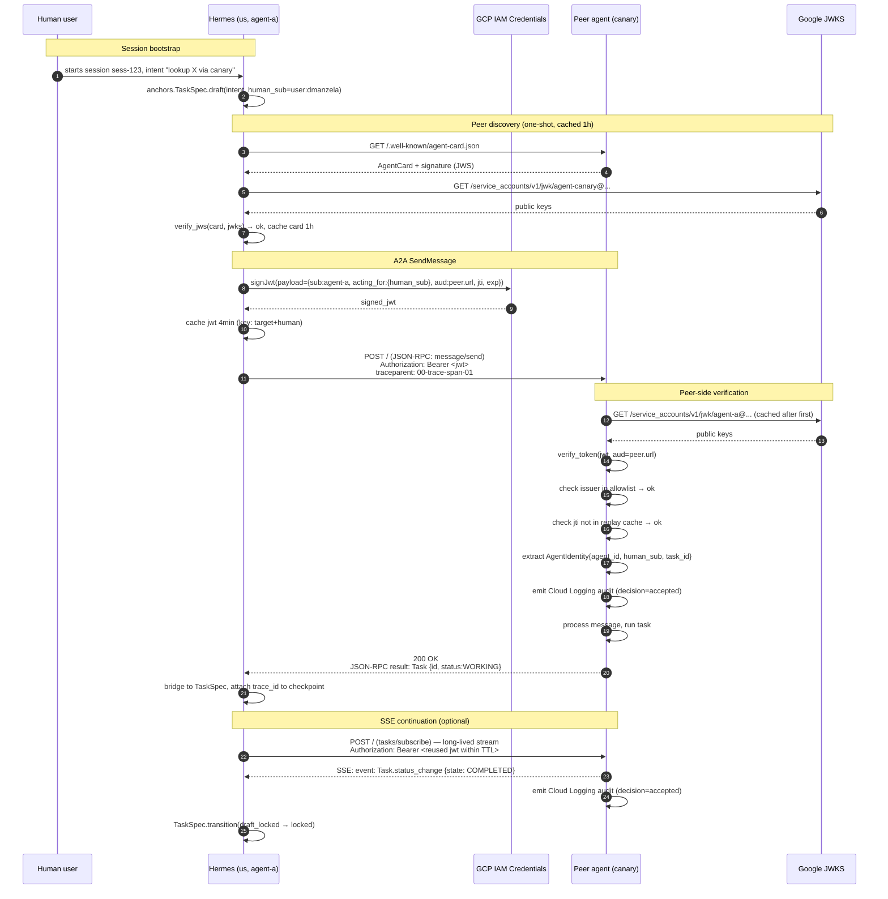

# A2A Authentication Design — Composite Identity via signJwt + Google-Hosted JWKS

**Date:** 2026-05-21
**Status:** Spike recommendation, not yet implemented.
**Decision authority:** Spike owner accepts/rejects; deviations require an ADR.
**Scope:** Both directions of the A2A wire (we as caller, we as callee). Single-region today (`us-central1`), but the design must not silently break when we add `us-east1` later.

---

## 1. Decision in one sentence

**Authenticate every A2A request with a custom JWT minted via the GCP `iam.serviceAccounts.signJwt` API, with claims that bind the agent identity AND the human-on-behalf-of identity into a single signed token, and let peers verify it against the Google-hosted JWKS endpoint at `https://www.googleapis.com/service_accounts/v1/jwk/{SA_EMAIL}`.**

Reject API keys outright. Defer mTLS to v2 (it solves a different problem and stacks cleanly on top of JWT later if we need transport-layer assurance).

---

## 2. Why this pattern — Gemini CLI verbatim

This recommendation came from a deep dive via `gemini --yolo` with the GCP architect prompt. The exchange evaluated four GCP-native patterns against nine criteria: latency, key rotation, replay resistance, audit fidelity, setup complexity, regional outage behavior, A2A AgentCard/JWS compatibility, agent-vs-human identity scope, and Google-internal precedent. Quoting Gemini verbatim on its top-line recommendation:

> **I recommend Pattern 3 (Custom JWT via `signJwt` API).**
>
> While it is tempting to use the native GCP OIDC tokens (Pattern 4), the A2A v1.0.0 protocol fundamentally requires an identity primitive that GCP's native edge does not support: **Composite Identity** (cryptographically binding the agent's identity *and* the human context into a single verifiable token).

And on the masterstroke of the pattern:

> The masterstroke of this pattern for the A2A protocol is that **you do not need to build or host a JWKS endpoint**. Google already does it for you. In your A2A `/.well-known/agent-card.json`, you simply set your verification URI to `https://www.googleapis.com/service_accounts/v1/jwk/{your-agent-sa@project.iam.gserviceaccount.com}`. The partner Google team fetches Google's public keys to verify your agent's cryptographic signature, achieving decentralized, composite identity with zero custom key management.

Gemini's per-pattern scorecards (paraphrased from the full response, with the headline verdict for each):

| Pattern | Latency p99 | A2A compat | Agent+Human scope | Verdict |
|---|---|---|---|---|
| 1. WIF cross-project | 150-300 ms | Poor | Poor | **Anti-pattern** — WIF is designed for *external* clouds, not GCP↔GCP. |
| 2. mTLS via CAS | <10 ms | Irrelevant (transport) | **Fails** — SANs are static, can't bind human context per request. | Transport-layer solution to an app-layer problem. |
| 3. **signJwt + Google JWKS** | 50-100 ms (paid at SSE connect) | **Perfect** — output is a JWS, AgentCard cites Google JWKS URL | **Perfect** — we control the JSON payload | **WINNER** |
| 4. Native OIDC (impersonation) | <5 ms | **Fails** — fixed schema, can't inject A2A signatures | **Fails** — only asserts SA identity | Splits the security model into "service auth at edge" + "human context in separate header" — agent could swap context. |

Why Gemini was right on the composite-identity point: the A2A spec's `Message.role` is only `USER` or `AGENT`. When a peer sends us a message with `role=AGENT`, the spec gives no field that tells us *which human commissioned that agent run*. If we put the human ID in an unsigned header, a compromised peer can replay an agent's token with a different human ID and gain privilege escalation. Binding both into one JWT signature closes that hole.

---

## 3. Critique of Gemini's recommendation — where the spike must do better

Gemini's recommendation is sound at the strategic level, but its execution sketch has four gaps that bite at production scale. The spike implementer must close these.

### 3.1 `jti` replay cache is unspecified

Gemini says "Vulnerable within the `exp` window unless the receiving agent implements strict `jti` (JWT ID) caching and nonce validation," then moves on. That's the whole replay defense and it needs concrete shape:

- Use `cachetools.TTLCache(maxsize=100_000, ttl=token_exp_window_seconds + 60)` keyed on `(iss, jti)`. Unbounded dict will OOM under load.
- Reject `jti` already in cache → return JSON-RPC error `-32600 InvalidRequest` (or a custom F-code; see [`integration-points.md` §10](./integration-points.md)).
- Cache must be **per-process** AND backed by Redis when we run multiple Cloud Run instances behind a load balancer — otherwise a replay against a different instance wins. Spike defers Redis to v2 with a single-instance check and a `TODO(replay-cache-distributed)`.
- Acceptance gate: write a `pytest` that replays the same JWT twice and asserts the second call is rejected.

### 3.2 HIPAA audit fidelity is "Manual" — needs explicit logging middleware, not a TODO

Gemini correctly flags:

> Because the Cloud Run service must be set to `Allow unauthenticated` to accept custom JWTs, you lose native IAM Data Access logs. Your application code must explicitly write structured JSON logs to Cloud Logging to achieve HIPAA compliance.

Concretely this means **every** A2A request (success and failure) MUST emit a structured Cloud Logging entry containing: `peer_agent_id`, `peer_human_sub`, `method`, `task_id`, `jti`, `decision` (`accepted` | `rejected_invalid_sig` | `rejected_replay` | `rejected_expired`), `trace_id`. Log to stdout as JSON; the Cloud Logging agent picks it up automatically and routes to a HIPAA-tagged log bucket via a Log Sink. We already have OTel→Cloud Logging in `deploy/otel/collector.prod.yaml` (exports to `googlecloud`), so the channel exists — we just need the auth middleware to actually emit on every verification attempt, including failures.

Without this we lose admissibility under our BAA. Treat it as a release blocker, not a nice-to-have.

### 3.3 `signJwt` latency is paid per call — we need an in-memory JWT reuse window

Gemini says:

> At sustained 100s req/s, you will likely hit default IAM Credentials API quotas and require a limit increase.

Even if we get the quota, calling `signJwt` on every outbound request adds 50-100 ms of network roundtrip to every A2A call. For a long-lived `SubscribeToTask` SSE stream this is paid once at connection, fine. But for a chatty `tasks/get` poll loop or any agent that makes many short calls this is a bottleneck.

Mitigation: cache the minted JWT in-memory keyed on `(target_agent_id, human_sub)` with TTL = `token_exp - 60s`. Re-mint when within 60s of expiry. This drops average latency by ~50ms and cuts IAM Credentials API call rate by ~1-2 orders of magnitude. Threadsafe via `cachetools.TTLCache` + `threading.Lock`.

### 3.4 JWS verification on the AgentCard ≠ JWT verification on the request — don't conflate

Gemini's "Google hosts the JWKS" point covers **both** request JWT verification AND AgentCard signature verification (the AgentCard is signed with a JWS per spec §8.4). Same JWKS URL serves both. But the trust models differ:

- **Request JWT**: short-lived (e.g. 300s), per-request, contains composite identity. Verify on every request.
- **AgentCard JWS**: long-lived (signed once, served via `/.well-known/`), describes capabilities. Verify on fetch (cache the result for the card's TTL, default 1h).

Don't share the verification cache between them. They have different invalidation semantics. Two separate `cachetools.TTLCache` instances, two different cache keys.

---

## 4. Token issuance — minter

### 4.1 Claims contract

```python
# lib/a2a/auth.py — JWT payload schema for outbound calls

{
    "iss": "agent-a@our-project.iam.gserviceaccount.com",   # who minted (= signing SA email)
    "sub": "agent-a",                                       # the agent identity
    "aud": "https://peer.example.com/a2a",                  # target endpoint URL
    "iat": 1716253200,                                      # issued-at (Unix seconds)
    "exp": 1716253500,                                      # 5-minute window (300s)
    "jti": "01HABCXYZ...",                                  # ULID — sortable, unique
    "acting_for": {                                         # ← composite identity
        "human_sub": "user:dmanzela@example.com",           # or kanban_card_id for autonomous
        "human_session_id": "sess-7e4f...",                 # for audit correlation
        "consent_scope": "task:execute"                     # narrow, not wildcard
    },
    "a2a": {
        "version": "1.0.0",                                 # echo of A2A-Version we'll send
        "task_id": "task-xyz" | null                        # null on message/send, set on continuations
    }
}
```

`acting_for` is non-standard JWT but allowed; it's namespaced under a single key so verifiers ignore it if they don't know about it. The spec does NOT prescribe a claim for the human identity (A2A v1.0.0 only has `Message.role: USER|AGENT`), so we're filling a gap — see [`open-questions.md`](./open-questions.md) Q1.

### 4.2 Minter sketch

```python
# lib/a2a/auth.py — sketch

from google.cloud import iam_credentials_v1
from cachetools import TTLCache
from threading import Lock
import json, time, ulid

_token_cache: TTLCache = TTLCache(maxsize=10_000, ttl=240)  # 4min, mint TTL is 5min
_cache_lock = Lock()
_client = iam_credentials_v1.IAMCredentialsClient()

def mint_token(
    *, target_audience: str, agent_sa: str,
    human_sub: str, human_session_id: str,
    task_id: str | None = None,
) -> str:
    key = (target_audience, agent_sa, human_sub, task_id)
    with _cache_lock:
        cached = _token_cache.get(key)
        if cached:
            return cached
    now = int(time.time())
    payload = {
        "iss": agent_sa, "sub": agent_sa.split("@", 1)[0],
        "aud": target_audience, "iat": now, "exp": now + 300,
        "jti": str(ulid.new()),
        "acting_for": {
            "human_sub": human_sub,
            "human_session_id": human_session_id,
            "consent_scope": "task:execute",
        },
        "a2a": {"version": "1.0.0", "task_id": task_id},
    }
    name = f"projects/-/serviceAccounts/{agent_sa}"
    resp = _client.sign_jwt(name=name, payload=json.dumps(payload))
    with _cache_lock:
        _token_cache[key] = resp.signed_jwt
    return resp.signed_jwt
```

IAM role required on the calling identity: `roles/iam.serviceAccountTokenCreator` on `agent_sa`. Already covered by the per-SA Terraform pattern in `terraform/phase-0a-gcp/iam.tf` — add an explicit `agent-a-runtime` SA and a binding granting the Cloud Run runtime SA `roles/iam.serviceAccountTokenCreator` on it.

---

## 5. Token validation — verifier

### 5.1 Verifier sketch

```python
# lib/a2a/auth.py — sketch (continued)

import httpx, jwt
from jwt import PyJWKClient
from cachetools import TTLCache
from threading import Lock

_jwks_clients: dict[str, PyJWKClient] = {}  # iss → client (auto-caches keys 1h)
_jti_cache: TTLCache = TTLCache(maxsize=100_000, ttl=360)  # exp+60s buffer
_jti_lock = Lock()

class AgentIdentity:
    agent_id: str
    human_sub: str
    human_session_id: str
    task_id: str | None

def verify_token(token: str, expected_audience: str) -> AgentIdentity:
    # 1. Decode header to learn `iss` (signing SA email) without verifying
    unverified = jwt.decode(token, options={"verify_signature": False})
    iss = unverified["iss"]

    # 2. Look up JWKS for this issuer (Google-hosted)
    if iss not in _jwks_clients:
        url = f"https://www.googleapis.com/service_accounts/v1/jwk/{iss}"
        _jwks_clients[iss] = PyJWKClient(url, cache_keys=True, lifespan=3600)
    jwks = _jwks_clients[iss]
    signing_key = jwks.get_signing_key_from_jwt(token)

    # 3. Verify signature, exp, iat, aud
    claims = jwt.decode(
        token, signing_key.key,
        algorithms=["RS256"],
        audience=expected_audience,
        options={"require": ["iss", "sub", "aud", "iat", "exp", "jti"]},
    )

    # 4. Check issuer against allowlist (see §6)
    if iss not in ALLOWED_PEER_AGENTS:
        raise AuthError("issuer_not_allowed", iss=iss)

    # 5. Replay defense
    jti_key = (iss, claims["jti"])
    with _jti_lock:
        if jti_key in _jti_cache:
            raise AuthError("replay_detected", jti=claims["jti"])
        _jti_cache[jti_key] = True

    # 6. Audit log — EVERY decision, including failures upstream of this
    _emit_audit_log(claims, decision="accepted")

    acting_for = claims.get("acting_for") or {}
    return AgentIdentity(
        agent_id=claims["sub"],
        human_sub=acting_for.get("human_sub", "unknown"),
        human_session_id=acting_for.get("human_session_id", "unknown"),
        task_id=(claims.get("a2a") or {}).get("task_id"),
    )
```

### 5.2 Key rotation

Google rotates the signing key behind a service account roughly every 2 weeks. `PyJWKClient(cache_keys=True, lifespan=3600)` re-fetches the JWKS every hour, which is well inside the rotation window — a new public key appears in the JWKS *before* Google starts signing with it. No manual rotation work for us.

### 5.3 Clock skew

PyJWT default `leeway=0`. Use `leeway=10` to absorb ±10s skew between caller and verifier; A2A interop notes mention this is the typical interop pain.

---

## 6. Trust establishment — peer allowlist

A correctly signed JWT from `random-attacker@their-project.iam.gserviceaccount.com` is cryptographically valid against Google's JWKS but is NOT a peer we trust. **The JWKS verification alone is not authorization.**

The spike maintains a static allowlist:

```yaml
# config/a2a/peers.yaml
peers:
  google-canary-agent:
    issuer: "agent-canary@gcp-canary-peer.iam.gserviceaccount.com"
    agent_card_url: "https://canary.example.com/.well-known/agent-card.json"
    public_id: "did:web:canary.example.com"
```

v2 will replace this with AgentCard discovery + signature pinning + a "first sight" trust ceremony, but the spike does not need to solve federation. See [`open-questions.md`](./open-questions.md) Q3.

---

## 7. Why not the alternatives

### 7.1 Why not API keys

- Static secret in transit; no rotation story without re-issuing to every peer.
- No identity binding — same key minted for `agent-a` is indistinguishable from one for `agent-b` if both leak.
- HIPAA: bearer secrets in plaintext logs are a finding. We'd have to scrub them on every log path.
- A2A spec calls them out (§7) as one option but the spec writers clearly preferred OAuth2/OIDC.
- **Hard no.**

### 7.2 Why not OAuth2 client_credentials

This would have us register as a client with each peer, get a `client_id` + `client_secret`, hit their token endpoint, get an access token, use it. Two problems:

1. Token endpoint is a per-peer dependency — adds a network hop the user can't observe.
2. The OAuth2 token contains *our* claims, not Google's claims about us. Verifier has to trust the peer's IdP, which means we have to operate one.

We can layer OAuth2 on top in v2 if a non-GCP peer demands it, but the spike does not need it.

### 7.3 Why not mTLS-only

mTLS at the transport layer is great for *transport assurance* — we know the connection is to the right host. But it does NOT carry per-request human context (X.509 SANs are static). We'd still need a JWT-or-equivalent in the application layer.

**The spike picks JWT-only and treats mTLS as a v2 hardening overlay.** When we add mTLS, JWT verification still happens; mTLS just becomes a perimeter check (only allowlisted peers can even open the TLS connection).

### 7.4 Why not WIF cross-project

Quoting Gemini: "*Using WIF for native GCP-to-GCP authentication is considered an architectural anti-pattern.*" WIF is for *external* identity providers (AWS, Azure, on-prem). For GCP↔GCP we have native impersonation. The only reason to consider WIF here would be if a non-GCP peer needed to federate INTO our project — that's a v2 scenario, not in scope.

---

## 8. Replay protection in depth

Three layers, defense-in-depth:

1. **`exp` window** — 5 minutes. Even if everything else fails, a stolen token expires fast.
2. **`jti` cache** — rejects literal token replay within the exp window. See §3.1.
3. **Audience pinning** — `aud` is set to the target endpoint URL. A token minted for peer A cannot be replayed to peer B; peer B's verifier checks `aud == its_own_url` and rejects.

Three independent failures must compound for a replay to succeed. Acceptable for HIPAA.

---

## 9. Canonical handshake — Mermaid sequence



Notes on the diagram:

- Steps 1-3 happen once per session.
- Steps 4-7 (AgentCard fetch) happen once per peer per cache window (1h). Steps 8-16 happen on every A2A call (with JWT cache hits on most of them).
- Steps 17-19 (peer-side verification) include JWKS lookup; PyJWKClient caches keys, so it's a one-time penalty per peer per hour.
- The traceparent in step 14 ties the inbound peer span to our outbound span — see [`telemetry-design.md`](./telemetry-design.md).
- Audit logs (steps 21, 26) are the HIPAA compliance gate from §3.2.

---

## 10. Open auth-related questions

These are surfaced for the spike but the answers are NOT in scope for the auth design itself. See [`open-questions.md`](./open-questions.md) for the full list:

- **Q1**: Is there a standardized claim shape for `acting_for` that other A2A implementers are converging on? If so, align to it; if not, document our shape as a starting point for the WG.
- **Q3**: Federation story for non-GCP peers — when do we need to support a peer signing with their own key vs. requiring everyone to use a Google-managed SA?
- **Q5**: PHI in JWT `acting_for.human_sub` — is `user:dmanzela@example.com` PHI under our BAA? If yes, we use opaque IDs (`pseudonym:abc123`) and store the mapping in a sealed table.

---

## 11. Acceptance criteria for the spike

The auth layer is "spike-complete" when ALL of these pass:

- [ ] Outbound minter: `mint_token` returns a token that decodes successfully with the matching JWKS, contains all required claims, and is cached for repeated calls within TTL.
- [ ] Inbound verifier: `verify_token` accepts a valid token from the allowlisted peer SA and returns the correct `AgentIdentity`.
- [ ] Replay test: same JWT presented twice — second call rejected with replay error.
- [ ] Expiry test: JWT past `exp` — rejected with expired error.
- [ ] Audience test: JWT minted for peer A presented to peer B — peer B rejects.
- [ ] Issuer-not-allowlisted test: valid JWT signed by an SA outside the peer allowlist — rejected.
- [ ] Audit log test: every verification (success + every failure mode) emits one structured Cloud Logging entry with the documented schema.
- [ ] Latency budget: median mint < 80ms after warmup (cache hit < 1ms). Median verify < 5ms after JWKS warmup.
- [ ] Bidirectional E2E with canary peer: both sides verify each other; one task flows end-to-end with all audit logs present.

---

## 12. What we are explicitly NOT doing in the spike

- **mTLS overlay** — v2.
- **Distributed `jti` replay cache (Redis)** — v2; single-instance is fine for spike.
- **AgentCard JWS *issuance*** — we will sign our own card, but the dynamic discovery flow is a §8 spec topic, not auth. Covered in `integration-points.md` §6.
- **Non-GCP peer federation** — v2; spike has 1 canary peer running on our GCP.
- **Key escrow / break-glass for compromised SA** — operational concern, not spike scope. Documented in `open-questions.md` Q6.
- **PHI redaction inside the JWT payload** — the spike treats `human_sub` as an opaque ID; whether that ID is PHI is a `open-questions.md` Q5 product decision.

---

## 13. References

- [`protocol-survey.md`](./protocol-survey.md) §7 — A2A security scheme types (oneof of APIKey/HTTPAuth/OAuth2/OIDC/mTLS).
- [`integration-points.md`](./integration-points.md) §8 — `lib/a2a/auth.py` placement and dependencies; §10 — F-code mappings F40-F49 for A2A auth errors.
- A2A spec §7 (security), §8.4 (AgentCard signature), §13 (security considerations).
- [IAM Credentials API: signJwt](https://cloud.google.com/iam/docs/reference/credentials/rest/v1/projects.serviceAccounts/signJwt).
- [Service account public keys (JWKS)](https://cloud.google.com/iam/docs/keys-create-delete#jwks).
- PyJWT [PyJWKClient](https://pyjwt.readthedocs.io/en/stable/usage.html#retrieve-rsa-signing-keys-from-a-jwks-endpoint).
- Verbatim Gemini transcript captured at `/private/tmp/claude-501/-Users-danielmanzela-RX-Research-Project-AutonomousAgent/4bdb6e25-ccf0-4e15-a792-a07cd6021b3b/tasks/bl2fs3tdm.output` — preserved for the auditor.
