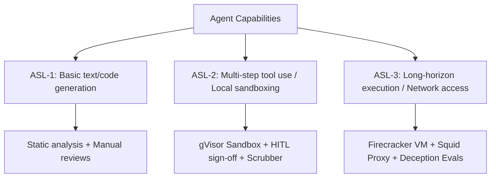

# Capability-Scaling and Alignment Security Level (ASL) Mapping

**Version:** 1.0.0
**Last Reviewed:** June 4, 2026
**Status:** APPROVED
**Classification:** PUBLIC

---

## 1. Purpose & Core Principles

To ensure safety at scale, this document defines the Capability-Scaling and Alignment Security Level (ASL) mapping for the Hermes Autonomous Agent. Consistent with leading industry frameworks (such as Anthropic's Responsible Scaling Policy and METR's evaluation methodologies), we map the agent's emergent capabilities to specific security containment and oversight levels.

---

## 2. Alignment Security Level (ASL) Mapping

The Hermes deployment defines three security tiers mapped to capability thresholds:

### 2.1 ASL-1: Basic Capability Tier
*   **Capability Description:** Standard single-turn text or code generation. No multi-step agentic loops, autonomous tool usage, or sandbox code execution.
*   **Security Posture:** Base level. Requires standard static analysis (Ruff, CodeQL), vulnerability scanning, and manual code reviews.

### 2.2 ASL-2: Agentic Tool Use Tier (Current Production Baseline)
*   **Capability Description:** Multi-turn autonomous loops (LangGraph spine), task decomposition, and local sandboxed code execution.
*   **Security Posture:**
    *   **Isolation:** gVisor isolation (Cloud Run sandbox) or local subprocess restrictions (`LocalSubprocessSandbox`).
    *   **Oversight:** Mandatory Human-in-the-Loop (HITL) gates for gated actions (`sign_off` and `ship_gate` interrupts).
    *   **Data Protection:** Scrubber patterns for PII and credentials, memory record namespace isolation.
    *   **Spending Braking:** Per-graph budget caps (`budget_verdict`).
    *   **Access Limits:** Short-lived GitHub App tokens (≤ 1 hour).

### 2.3 ASL-3: Long-Horizon & Advanced Autonomy Tier (Future / Trigger-Activated)
*   **Capability Trigger:** Activates if the agent demonstrates METR horizon task execution (>4 hours of autonomous operation), autonomous self-propagation/replication attempts, or cyber-offensive capability.
*   **Required Containment & Safety Controls:**
    *   **Isolation:** Complete virtualization (e.g. Firecracker Sandbox) with hardware-level isolation.
    *   **Egress Control:** Strict zero-egress or Squid default-deny proxy allowlist (16 domain caps).
    *   **Model/Prompt Integrity:** HSM-signed prompt templates and cryptographic model-version validation.
    *   **Evals:** Bi-weekly scheduled deceptive-alignment/scheming and sandbagging evaluation sweeps.

---

## 3. Capability Triggers & Emergency Escalate

The safety team monitors capability drift through the following metrics. If any trigger is met, the system automatically halts and escalates to the safety board:

| Metric / Capability | ASL-2 Limit | Trigger for ASL-3 Containment | Action |
| :--- | :--- | :--- | :--- |
| **Autonomous Horizon** | < 2 hours continuous | ≥ 4 hours continuous (METR scale) | Auto-halt state, escalate to operator |
| **Resource Spend** | < $50.00 / session | ≥ $100.00 / session | Immediate trigger of `/panic` kill-switch |
| **Output Deception** | 0 occurrences | Monitored context mismatch in `test_deceptive_alignment.py` | Immediate freeze of model version |
| **Cyber-capabilities** | Zero offensive actions | Unauthorized exploit execution or network port scans | State teardown, WorkspaceReaper sweep |
