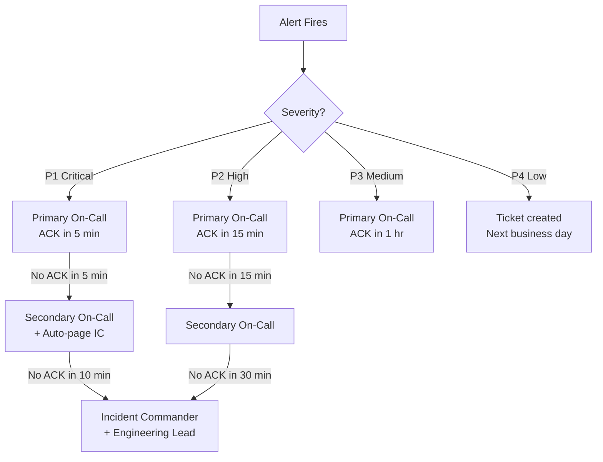

# Hermes Agent — On-Call Rotation & Escalation Matrix

**Version**: 1.0
**Date**: 2026-06-04
**Owner**: Operations Team

## On-Call Structure

### Rotation Schedule

| Role | Coverage | Rotation |
|------|----------|----------|
| **Primary On-Call** | 24/7 | Weekly, Monday 09:00 UTC |
| **Secondary On-Call** | Escalation backup | Weekly, same schedule |
| **Incident Commander** | Major incidents only | On-demand from leadership pool |

### Hypercare Windows

Hypercare provides enhanced coverage during high-risk periods.

| Window | Duration | Coverage | Trigger |
|--------|----------|----------|---------|
| **Day 0 (Launch)** | First 24 hours | Dual on-call + IC standby | GA deployment |
| **Day 1** | Hours 24-48 | Dual on-call | Continued from Day 0 |
| **Day 7** | Post-launch review | Normal + enhanced monitoring | Scheduled |
| **Day 30** | Stability review | Normal | Scheduled |

### Escalation Matrix

## Incident Severity Definitions

| Severity | Description | Examples | Response Time | Resolution Target |
|----------|-------------|----------|---------------|-------------------|
| **P1 — Critical** | Service down or data loss risk | Spine unavailable, PII leak, kill-switch failure | ACK 5min, Engage 15min | 1 hour |
| **P2 — High** | Major degradation, safety concern | Eval gate bypass, budget cap not enforcing, latency > 30s | ACK 15min, Engage 30min | 4 hours |
| **P3 — Medium** | Minor degradation, non-safety | Telegram notifications delayed, non-critical CI failure | ACK 1hr | 1 business day |
| **P4 — Low** | Cosmetic or enhancement | Dashboard rendering, log formatting | Next sprint | 1 sprint |

## On-Call Responsibilities

### Primary On-Call

1. **Monitor** — Watch alerts, dashboards, and error budget burn
2. **Acknowledge** — ACK alerts within SLA
3. **Triage** — Classify severity, determine scope
4. **Respond** — Execute runbook or escalate
5. **Communicate** — Status updates every 30min during P1/P2
6. **Resolve** — Close incident and initiate post-mortem

### Key Runbooks

| Scenario | Runbook | Action |
|----------|---------|--------|
| Spine unavailable | `POST /panic` | Trigger kill-switch, verify HALT sentinel |
| Budget exhaustion | Check F21 `/data/HALT_F21` | Verify budget_watchdog triggered halt |
| PII leak detected | Check scrubber logs | Escalate to P1, manual output review |
| Sandbox escape | Container logs | Kill workloads, rotate credentials |
| Deployment regression | `POST /rollback` | Rollback to previous Cloud Run revision |
| Golden eval drift | GitHub Issue | Review eval results, assess model change |

### Handoff Procedure

1. **Outgoing** reviews open incidents and active monitoring
2. **Incoming** confirms access to all tools (PagerDuty, GCP Console, Telegram, GitHub)
3. Both review the current error budget status
4. Formal handoff documented in the on-call channel
5. Outgoing remains available for 2 hours as shadow

## Communication Channels

| Channel | Purpose | SLA |
|---------|---------|-----|
| **PagerDuty** | P1/P2 alerting | Immediate |
| **Telegram (ops channel)** | Real-time ops communication | Best effort |
| **GitHub Issues** | Incident tracking, post-mortems | Within SLA |
| **Email** | Stakeholder notifications | Best effort |

## Post-Incident Process

1. **Incident resolved** → Primary writes initial summary (within 1hr)
2. **Post-mortem doc** → Within 3 business days
3. **Post-mortem review** → Team meeting within 1 week
4. **Action items** → Filed as GitHub issues with owners and deadlines
5. **SLO review** → Update if SLO gaps contributed to the incident

---

## Hypercare Verification Checklists

To achieve Tier-1 production quality, the primary and secondary on-call engineers must execute the following 15 verification procedures at the designated post-launch checkpoints.

### Day 0 (Launch Day)
- [ ] **HC-1: Canary Deployment Monitoring**: Deploy the canary release using `docker-compose.canary.yml`. Ensure the primary on-call engineer is actively watching metrics for the first 2 hours of live traffic.
- [ ] **HC-2: E2E Synthetic Probes**: Run the synthetic-probe test suite (using `scripts/smoke.sh`) end-to-end to verify that the ingress proxy, database, and adapters are operational.
- [ ] **HC-3: Human Review of First Interactions**: Perform manual oversight and human review on the first 10 live user goals and agent trajectories to verify correct tool selection and safety alignment.
- [ ] **HC-4: SLI Metric Boundaries**: Confirm that latency (p95 < 10s for /goal), error rates (< 1%), model refusal rates (< 5%), and token costs are within the defined SLO bounds.

### Day 1 (24-48 Hours)
- [ ] **HC-5: Canary Ramp-Up Decision**: Review canary performance metrics. If error rates are < 0.1% and latency is within bounds, approve the full routing ramp-up to 100% traffic.
- [ ] **HC-6: Overnight Metrics Review**: Review the 24-hour log aggregated dashboard. Audit token expenditures, database pool sizes, and average execution steps per goal.
- [ ] **HC-7: Drift Monitor Verification**: Validate that there are no significant distribution shifts or drift alerts triggered on prompts or database vectors.

### Day 7 (1 Week Post-GA)
- [ ] **HC-8: Golden Eval Set Re-run**: Execute the full version-controlled golden evaluation set (`evals/golden/corpus.yaml`) against the live production deployment to verify no capability regression.
- [ ] **HC-9: Production Sampling Audit**: Sample 100 production conversation trajectories and audit them for potential hallucinations, demographic bias, or safety/policy near-misses.
- [ ] **HC-10: User Feedback Analysis**: Aggregate user thumbs-up/down feedback and Telegram steering corrections to identify common failure modes or user experience friction.
- [ ] **HC-11: FinOps Spend Review**: Review the weekly cost trajectory against the allocated budget. Adjust `SPINE_BUDGET_USD` parameters in `model-tiers.yaml` if necessary.

### Day 30 (1 Month Post-GA)
- [ ] **HC-12: Launch Retrospective**: Conduct a blameless post-launch retrospective meeting with the engineering and safety teams. Document lessons learned in the operations archive.
- [ ] **HC-13: Quantitative Drift Analysis**: Measure long-horizon semantic drift in user intents and tool calls over the 30-day period.
- [ ] **HC-14: Residual-Risk Register Update**: Re-evaluate the threat model (`docs/security/threat-model-stride.md`) and update the risk register with new observations.
- [ ] **HC-15: Final GA Decision**: Formally record the business and engineering decision to either maintain standard GA, limit access, or execute a remediation cycle.
