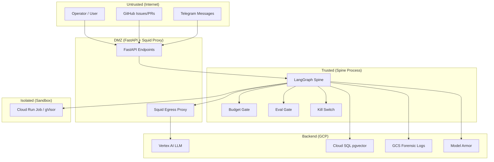
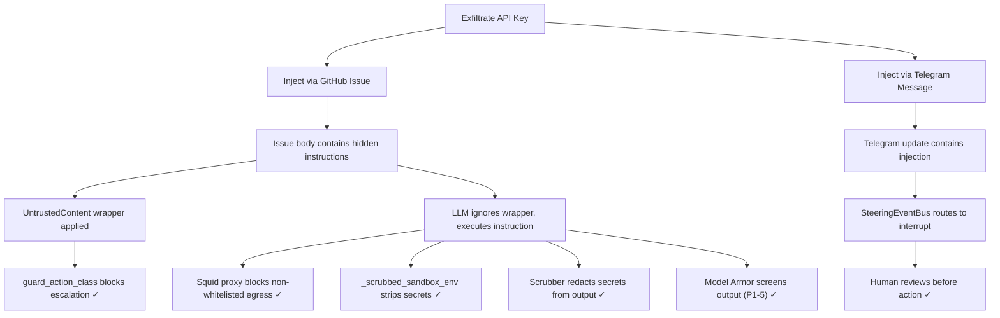
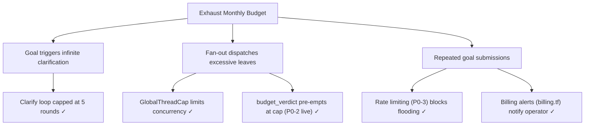

# Hermes Agent — STRIDE Threat Model

**Version**: 1.0
**Date**: 2026-06-04
**Status**: INITIAL — Requires security review sign-off

## 1. System Overview

The Hermes Agent is an autonomous AI agent that reads project goals, decomposes them into tasks, executes them in sandboxed environments, and ships deliverables. It operates on GCP (Vertex AI, Cloud Run, Cloud SQL) with GitHub as the primary code platform.

### Trust Boundaries

## 2. STRIDE Analysis

### S — Spoofing (Identity)

| # | Threat | Assets at Risk | Controls | Gap | Severity |
|---|--------|---------------|----------|-----|----------|
| S1 | Attacker spoofs API caller identity | FastAPI endpoints | **ABSENT**: No AuthN/AuthZ middleware on FastAPI | Rate limiting (P0-3) added; AuthN needed | HIGH |
| S2 | Attacker forges GitHub webhook | Spine state, code execution | GitHub App webhook secret verification (`lib/github_auth.py`) | HMAC validation present | LOW |
| S3 | Stolen GitHub App installation token | Repository access | Short-lived tokens (≤1hr), WIF-only auth, `no-sa-key-gate` CI gate | Covered | LOW |
| S4 | Attacker spoofs Telegram updates | Spine interrupts | Bot token verification, `SteeringEventBus` arbitration | Token-based only; no IP allowlisting | MEDIUM |
| S5 | Cross-tenant memory access | Memory store | `MemoryRecord._tier_namespace_invariant` enforces project_id isolation | Covered | LOW |

### T — Tampering (Integrity)

| # | Threat | Assets at Risk | Controls | Gap | Severity |
|---|--------|---------------|----------|-----|----------|
| T1 | Checkpoint poisoning via crafted resume | Graph state | `assert_serializable_state` (no callables), `scrub_state` (PII), `extra="forbid"` on schemas | No cryptographic integrity on checkpoints | MEDIUM |
| T2 | Prompt injection via GitHub issue body | LLM decisions | `UntrustedContent` wrapper, `guard_action_class` rejects untrusted escalation | No runtime prompt quarantine parser | HIGH |
| T3 | Dependency supply chain attack | Build artifacts | Trivy, OSV-Scanner, CodeQL, SBOM+Cosign, license gate | Covered | LOW |
| T4 | Golden eval set tampering | Evaluation integrity | `SHA256SUMS` file in `evals/golden/`, `acceptance-frozen.yml` CI gate | SHA pins in-repo (visible to devs) | MEDIUM |
| T5 | Model weight/prompt tampering | LLM behavior | Vertex AI API (no local weights), WIF auth | No runtime model-version pinning | MEDIUM |

### R — Repudiation (Non-repudiation)

| # | Threat | Assets at Risk | Controls | Gap | Severity |
|---|--------|---------------|----------|-----|----------|
| R1 | Operator denies triggering panic | Audit trail | OTel spans on all tool calls, `decision_record` in state, `forensic_log_archive` GCS bucket | No operator identity in audit logs (no AuthN) | MEDIUM |
| R2 | Agent denies harmful output | Accountability | Full trajectory logging, `llm.reasoning` attribute on spans | Covered | LOW |
| R3 | Deletion of audit logs | Forensic evidence | GCS Coldline bucket with 90-day retention + versioning, `forensic_log_archive` | Covered | LOW |

### I — Information Disclosure

| # | Threat | Assets at Risk | Controls | Gap | Severity |
|---|--------|---------------|----------|-----|----------|
| I1 | Secret exfiltration via sandbox | API keys, tokens | `_scrubbed_sandbox_env` (default-deny allowlist), 15-pattern scrubber, `ScrubFilter` on logs | Covered | LOW |
| I2 | PII leak in LLM outputs | User data | `scrub_string` on goal, `scrub_state` on checkpoints, `ScrubFilter` on logs | No output-side PII screening before delivery | MEDIUM |
| I3 | Data exfiltration via egress | Internal data | Squid proxy (16-domain allowlist), `_EGRESS_ALLOWED_PHASES` (empty frozenset = all denied) | Covered | LOW |
| I4 | Memory cross-contamination | Project data | `MemoryRecord` tier/namespace invariant, `model_validator` enforcement | Covered | LOW |
| I5 | Log-based credential exposure | Secrets | `ScrubFilter` on root logger, `scrubber-patterns.yaml` (15 patterns) | Covered | LOW |

### D — Denial of Service

| # | Threat | Assets at Risk | Controls | Gap | Severity |
|---|--------|---------------|----------|-----|----------|
| D1 | API flooding | Service availability | SlowAPI rate limiting (P0-3) | Implemented | LOW |
| D2 | Runaway LLM loop | Budget | `budget_verdict` per-graph cap, `GlobalThreadCap`, clarify loop ≤5 rounds | Cost threading now live (P0-2) | LOW |
| D3 | Resource exhaustion via fan-out | Disk/FDs/CPU | `GlobalThreadCap` (SPINE_MAX_ACTIVE), `BranchLease` advisory locks | Covered | LOW |
| D4 | Checkpoint storage exhaustion | Disk | `checkpoint_retention.py` configurable retention | No automated cleanup schedule | MEDIUM |

### E — Elevation of Privilege

| # | Threat | Assets at Risk | Controls | Gap | Severity |
|---|--------|---------------|----------|-----|----------|
| E1 | Untrusted content escalates action class | Tool execution | `guard_action_class` rejects `UntrustedContent`-derived escalation, `ActionClass` 3-tier (PRE_AUTH/GATED/FORBIDDEN) | Covered | LOW |
| E2 | Sandbox escape | Host system | `CloudRunJobSandbox` (gVisor), `LocalSubprocessSandbox` (rlimit+seccomp) | `FirecrackerSandbox` stub (not production-ready) | MEDIUM |
| E3 | Agent self-modifies its own code | Codebase integrity | `is_path_allowed_for_write` (sandbox `sitecustomize.py`), `_safe_sandbox_workdir` (tempdir-only) | Covered for sandbox; no protection on in-process path | MEDIUM |
| E4 | Operator escalates beyond their role | System configuration | GitHub App permissions scoped to repo, branch protection (25 gates) | No RBAC on FastAPI endpoints | HIGH |

## 3. Attack Trees

### Attack Tree A: Secret Exfiltration via Indirect Prompt Injection

### Attack Tree B: Cost Exhaustion (Runaway Loop)

## 4. Risk Register

| ID | Threat | Severity | Likelihood | Risk | Control Status | Remediation |
|----|--------|----------|-----------|------|----------------|-------------|
| S1 | No API AuthN | HIGH | HIGH | **CRITICAL** | P0-3 rate limit only | Add OAuth2/API-key middleware |
| T2 | Prompt injection | HIGH | MEDIUM | **HIGH** | UntrustedContent + Model Armor | Runtime prompt quarantine |
| E4 | No RBAC | HIGH | MEDIUM | **HIGH** | None | Add role-based access control |
| T1 | Checkpoint tampering | MEDIUM | LOW | **MEDIUM** | Serialization guards | Add HMAC on checkpoints |
| D4 | Storage exhaustion | MEDIUM | MEDIUM | **MEDIUM** | Retention config exists | Schedule automated cleanup |
| I2 | PII in outputs | MEDIUM | MEDIUM | **MEDIUM** | Scrubber + Model Armor | End-to-end PII screening |

## 5. Residual Risk Acceptance

The following risks are accepted for the current deployment stage (sandbox/staging):

1. **No AuthN on FastAPI (S1/E4)**: Acceptable for internal-only deployment behind VPC. **MUST** be closed before any public exposure.
2. **No cryptographic checkpoint integrity (T1)**: Low-likelihood attack in a single-process spine. Acceptable until multi-tenant deployment.
3. **In-process code execution path**: When `SPINE_SANDBOX` is unset, code runs in-process. Acceptable for dev/CI; blocked in production by `OrchestratorConfig.validate()`.

---

**Next review**: Before GA deployment
**Sign-off required from**: Security Lead, Platform Lead, Product Owner
